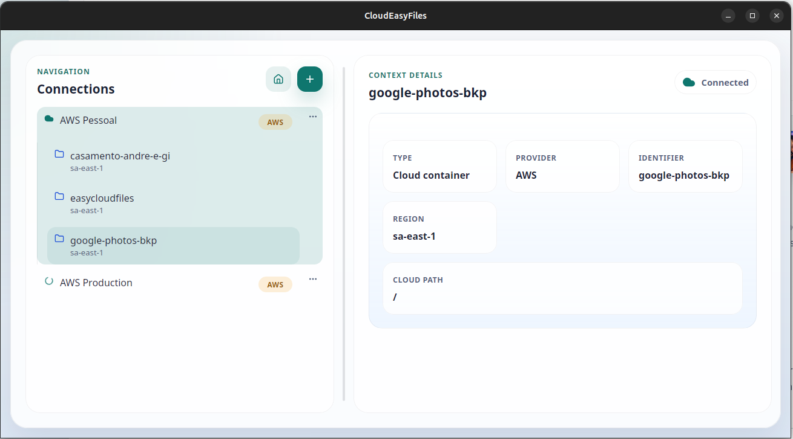

# CloudEasyFiles

> Desktop file explorer for cloud storage.

CloudEasyFiles is a Tauri desktop application for browsing and operating on cloud storage with a cleaner, more practical workflow than provider consoles usually offer. The current product supports AWS S3 and Azure Blob Storage, with first-class handling for archival workflows such as AWS restore requests and Azure Archive rehydration.



## Current Status

The repository is ahead of the initial `0.1.0` AWS milestone and already includes working AWS and Azure flows in the current codebase.

Current implementation highlights:

- Saved AWS and Azure connections with secure credential storage
- Bucket and container browsing with incremental loading
- Folder-style navigation over flat object storage
- Upload, tracked download, and `Download As`
- Folder creation and delete workflows
- Tier changes for AWS and Azure
- AWS restore requests for archived objects
- Azure Archive rehydration with destination tier and priority
- Local cache awareness, transfer tracking, and cancelation

## Support Matrix

| Capability | AWS S3 | Azure Blob Storage |
| --- | --- | --- |
| Connection create/edit/test/delete | Yes | Yes |
| Browse buckets/containers and objects | Yes | Yes |
| Incremental listing and filters | Yes | Yes |
| Upload | Yes | Yes |
| Tracked download and `Download As` | Yes | Yes |
| Folder creation | Yes | Yes |
| Delete files and folders | Yes | Yes |
| Tier change | Yes | Yes |
| Archived content recovery | Restore | Rehydration |

## Why This Project Exists

CloudEasyFiles is focused on a problem that provider consoles handle poorly: operational work on low-cost object storage and archival data.

The product direction is intentionally pragmatic:

- keep provider-specific behavior honest instead of forcing fake parity
- normalize browsing and transfer workflows where that helps usability
- make archive state, download readiness, and transfer progress easier to understand
- preserve a maintainable architecture suitable for real production work and portfolio review

## Tech Stack

- Desktop shell: Tauri
- Backend: Rust
- Frontend: React, TypeScript, Vite
- Styling: CSS
- AWS integration: AWS SDK for Rust
- Azure integration: Azure Blob Storage data-plane integration in Rust

## Local Development

### Prerequisites

- Node.js
- Rust
- Tauri platform prerequisites for your OS

### Commands

```bash
npm install
npm run tauri:dev
```

Quality checks:

```bash
npm run check
```

Available scripts:

- `npm run dev`
- `npm run build`
- `npm run check`
- `npm run check:frontend`
- `npm run check:rust`
- `npm run tauri:dev`
- `npm run tauri:build`

## Packaging and Releases

Local Linux bundles can be generated with:

```bash
npm run tauri:build
```

The repository also includes GitHub Actions workflows for:

- continuous integration on pushes and pull requests
- manual Linux release builds that publish `.deb`, `.rpm`, and `AppImage` artifacts
- tag-based GitHub Releases that publish Linux and Windows installers as release assets

Latest published installers:

- [GitHub Releases](https://github.com/andre-luiz-pires-silva/cloudeasyfiles/releases/latest)

## Documentation Map

- Project index: [PROJECT.md](./PROJECT.md)
- Architecture docs: [`docs/architecture`](./docs/architecture)
- Product docs: [`docs/product`](./docs/product)
- ADRs: [`docs/decisions`](./docs/decisions)
- Feature specs and plans: [`features`](./features)
- Release notes: [`docs/releases`](./docs/releases)

## Repository Quality

The repository baseline is intentionally lightweight but explicit:

- frontend build must pass
- `cargo check` must pass
- pull requests use a review checklist
- manual release artifacts are generated by workflow
- key product and architecture decisions are documented in-repo

## Roadmap Direction

Near-term professionalization work after the current feature set:

- tighten repository docs and screenshots
- expand CI and release hygiene
- add more automated verification where it adds real signal
- continue reducing rough edges in packaging and platform integration

## Contributing and Security

- Contribution guide: [CONTRIBUTING.md](./CONTRIBUTING.md)
- Security policy: [SECURITY.md](./SECURITY.md)

## License

[MIT](./LICENSE)
