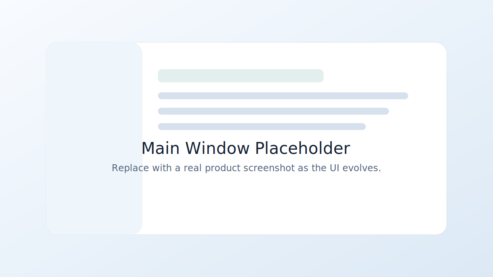
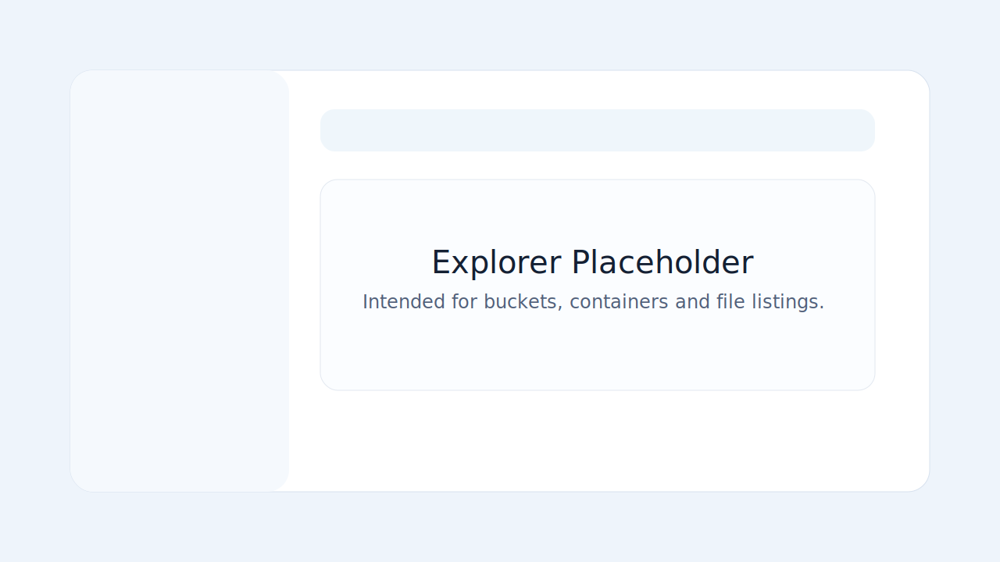
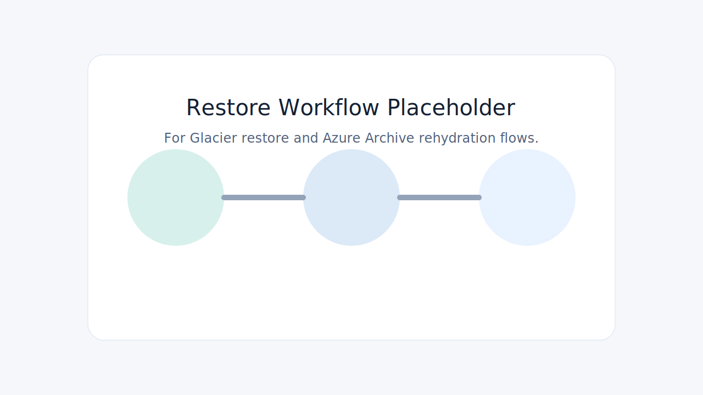

# CloudEasyFiles

> A unified desktop file explorer for AWS S3 and Azure Blob Storage.

CloudEasyFiles is a desktop application that provides a clean, intuitive interface for managing files across cloud storage providers. It is designed to reduce the complexity of working directly with provider-specific APIs and workflows, offering a consistent experience for browsing, transferring, and managing cloud files with an emphasis on simplicity and ease of use.

The current working build is AWS-first. It already supports saved AWS connections, bucket browsing, incremental listing, manual refresh, tracked cache downloads with progress, `Download As`, transfer tracking in the footer and modal, download cancelation, local-cache-aware file state in the explorer, and provider-driven restore-state detection for archived S3 objects. Azure remains part of the product direction, but is not wired into the current implementation yet. AWS restore request submission is still documented as the next archival workflow step rather than a delivered UI flow.

For the project documentation map, architecture references, ADRs, and feature specs, see [PROJECT.md](./PROJECT.md) and the documents under [`/docs`](./docs).

The project initially targets AWS S3 and Azure Blob Storage, including archival storage workflows such as AWS Glacier restores and Azure Archive tier rehydration.

Although the interface looks folder-oriented, CloudEasyFiles works on top of object storage. AWS S3 and Azure Blob Storage use a flat namespace rather than real directories in the traditional file system sense. CloudEasyFiles presents folders as a navigable product abstraction backed by object-key prefixes and, when a folder is created explicitly in the app, an empty sentinel object whose key ends with `/`.

## Why Archival Storage Matters

Many teams need to keep large volumes of backup and historical data for long periods of time. As that data grows, standard cloud storage can become expensive.

AWS and Azure both offer low-cost archival storage options such as Glacier, Deep Archive, and Archive tier. These options reduce storage cost significantly, but they also introduce operational complexity:

- Archived files are not immediately available
- A restore or rehydration request must be submitted first
- Retrieval may take minutes or even hours
- Provider consoles are often cumbersome for this workflow

CloudEasyFiles exists in part to make this practical. Instead of forcing users to learn two different archival workflows, the project is being shaped to present a simpler and more consistent way to detect restore state, monitor availability, and download archived files.

## Why CloudEasyFiles

CloudEasyFiles makes low-cost cloud storage more practical to use day to day.

- It abstracts provider-specific archival complexity
- It shows provider-driven archival availability directly in the explorer
- It makes it clear when a file is ready to download
- It keeps room for provider-specific restore request flows instead of forcing fake parity

## Screenshots

The repository currently includes SVG placeholders that can later be replaced by real product screenshots.





## Features

- Connect and manage multiple AWS and Azure accounts
- Save configured AWS and Azure connections in a tree-based navigation sidebar
- Browse cloud resources through a familiar interface inspired primarily by VSCode, with pgAdmin and DBeaver as secondary references
- Update the main content area based on the selected tree node, showing relevant details and contextual actions
- Keep the sidebar intentionally simplified, showing only saved connections and cloud containers
- Explore files and folders in the main content area, where object browsing happens level by level
- Run tracked AWS cache downloads with progress indicators
- Export files with `Download As` to a user-selected destination
- Track active downloads from the bottom bar and an active-transfer modal
- Cancel active `Download` and `Download As` operations from the file menu or transfer modal
- Use a unified interface across supported providers
- View clear file state indicators such as available, archived, and restoring
- Understand file status clearly through local indicators such as not downloaded, available to download, restoring, and downloaded
- Simplify archival workflows:
  - AWS S3 restore-state detection and availability summaries
  - future AWS S3 Glacier restore requests
  - future Azure Blob Archive rehydration
- Normalize storage tier differences across providers so archival content is presented consistently
- Optionally track downloaded files through a global local cache directory configured on Home
- Quickly refine visible items through `Filter`
- Prepare more powerful provider-aware discovery through `Advanced Search`
- Build on an extensible architecture designed for future provider support

## Architecture Overview

CloudEasyFiles is designed as a portfolio-quality example of clean architecture applied to a real-world desktop application.

At a high level, the system is structured around a small set of clearly separated layers:

- `Frontend UI`
  - Responsible for rendering the desktop experience, navigation, dialogs, status indicators, and user interactions
- `Application / Orchestration Layer`
  - Coordinates file operations, progress reporting, provider selection, and cross-cutting workflows
- `Domain / Core Logic`
  - Defines shared models, abstractions, and business rules independent of any specific cloud provider
- `Provider Adapters`
  - Encapsulate AWS and Azure implementation details behind stable interfaces
- `Infrastructure`
  - Handles HTTP, SDK integrations, serialization, local persistence, and platform-specific concerns

The core browsing model is intentionally provider-agnostic. Buckets and blob containers are treated as cloud containers, while files and folders are presented as cloud items in the main panel. This allows the UI to offer a consistent experience even though each provider exposes its data differently.

### Architectural Goals

- Strong separation of concerns
- Provider-specific behavior isolated behind interfaces
- Centralized orchestration for file operations and long-running workflows
- Reusable core logic for status handling, progress updates, and UI synchronization
- Extensible design for onboarding additional providers in the future
- Maintainable codebase suitable for production and portfolio presentation

## Tech Stack

### Desktop Application

- **Framework:** Tauri
- **Backend:** Rust
- **Frontend:** React, TypeScript, and Vite
- **Styling:** CSS

### Core Libraries

- **Async runtime:** Tokio
- **Serialization:** Serde
- **HTTP client:** Reqwest

### Cloud Integrations

- **AWS:** AWS SDK for Rust (S3)
- **Azure:** Azure SDK for Rust (Blob Storage)

## Installation

Installation instructions will be expanded as the initial project structure is finalized.

### Prerequisites

- [Rust](https://www.rust-lang.org/tools/install)
- [Node.js](https://nodejs.org/)
- Platform prerequisites required by [Tauri](https://tauri.app/start/prerequisites/)
- Valid AWS and/or Azure credentials once provider integrations are added

### Development Setup

```bash
# clone the repository
git clone https://github.com/andre-luiz-pires-silva/cloudeasyfiles.git

# enter the project directory
cd cloudeasyfiles

# install JavaScript dependencies
npm install

# run only the frontend in development
npm run dev

# build the frontend bundle
npm run build

# run the desktop app in development
npm run tauri dev
```

When the application starts successfully, it opens a desktop window and renders the initial greeting:

```text
Hello, CloudEasyFiles!
```

### Notes for Windows

Tauri requires the Microsoft C++ build tools and WebView2 runtime on Windows. If the app does not start, confirm the official Tauri prerequisites before troubleshooting the project itself.

## Usage

CloudEasyFiles is intended to feel familiar to anyone who has used tools such as VSCode, pgAdmin, or DBeaver, with VSCode serving as the primary reference for a simple and approachable navigation model.

Typical workflow:

1. Launch the application
2. Add one or more AWS or Azure accounts
3. Save those connections in the left navigation tree for future access
4. Select a connection or bucket/container from the tree
5. Review the selected node details and available actions in the main panel
6. Browse immediate folders and files in the main panel, one level at a time
7. Use `Filter` to quickly refine the items currently visible on screen
8. Use `Advanced Search` when you need more powerful search options
9. Perform available file operations such as tracked download and local cache inspection
10. Monitor operation progress and file state changes in the UI
11. Refresh the current listing when needed to rediscover archived, restoring, or temporarily available content

### How Cloud Listing Works

- The sidebar shows only higher-level structure such as saved connections and buckets or containers
- Selecting a saved connection can also show its loaded containers in the main content area
- Files and folders are browsed in the main content area
- Folders are backed by a hybrid object-storage model:
  - a folder may exist implicitly when descendant objects share its prefix
  - a folder created explicitly in the app creates an empty sentinel object whose key ends with `/`
- Listing consolidates prefix-derived folders and explicit folder sentinels into one visible folder entry
- The app resolves and lists only the immediate level for the current path
- The explorer uses incremental loading with `Carregar mais` instead of numbered pages
- Provider continuation tokens remain internal and are not exposed as primary UX terminology
- The current path is shown through a breadcrumb that starts at the selected connection
- Files and folders are always listed from the cloud provider
- The local cache does not replace cloud listing and does not act as a sync engine
- Local information only affects status indicators such as whether a file is downloaded and eligible for tracked download

Explorer counts are based on normalized navigable entries in the current listing, not on the raw number of objects or blobs returned by the provider. This matters because flat object-storage responses may be adapted into folders, grouped prefixes, explicit folder sentinels, or deduplicated visual items before they are rendered.

This keeps the sidebar simple, avoids overcrowding, and makes object browsing easier to follow in the main panel.

### Filter and Advanced Search

CloudEasyFiles supports two different ways to narrow what you are looking at:

- `Filter`
  - Available in the sidebar and in the main content area
  - Works only on items already loaded in that area
  - Does not trigger new provider calls
  - Does not change the loaded dataset or continuation state
- `Advanced Search`
  - Uses a dedicated modal dialog
  - Designed for more powerful search options in the future
  - May use provider-specific capabilities when needed

In practice, `Filter` is for quick on-screen refinement, while `Advanced Search` is for deeper cloud searches.

In the main explorer, the counter language is:

- without local filter: `X itens carregados`
- with local filter: `X itens filtrados de Y carregados`

The current AWS explorer also supports status-only refinement for the already loaded file set. The toolbar can narrow visible files by normalized status such as `Downloaded`, `Available`, `Restoring`, and `Archived`, while folders remain visible for navigation.

When the current loaded context contains files with known statuses, the footer counter adds a compact breakdown beside the loaded-count label so the user can understand the mix of downloaded, available, restoring, and archived items without leaving the current view.

The UI does not promise a total number of pages or a reliable global total of items for the directory based only on native provider listing.

### Storage Availability

CloudEasyFiles simplifies storage tier differences across providers:

- AWS Glacier-style content and Azure Archive content are both presented as `Archived`
- Restore and rehydration workflows are both presented as `Restoring`
- Temporarily restored AWS archival objects are treated as `Available` when the provider reports that they can currently be used
- The UI focuses on whether a file is available to use, not on provider-specific storage jargon

### Archival Storage Support

CloudEasyFiles is designed to make archived storage easier to work with.

- The current AWS implementation detects when a file is archived
- The current AWS implementation shows when a file is still restoring
- The current AWS implementation recognizes when AWS reports a temporarily restored archival object as available again
- The current AWS implementation allows download when the file becomes available
- Provider-specific restore request flows are still documented separately from the current delivered UI

### Restore Workflow

The restore request experience is currently documented as the intended next AWS archival workflow, not as a delivered UI flow yet.

The planned experience is intended to be direct and understandable:

1. The user sees a file marked as archived
2. The user clicks `Restore`
3. A confirmation modal shows the available restore options, estimated time, and estimated cost when the provider supplies that information
4. The user confirms the restore request
5. The file enters the `Restoring` state
6. The user tracks progress directly in the file list
7. When the restore is complete, the file becomes available for download

### Local Cache (Optional)

Users can optionally configure a global local cache directory on the Home screen.

When local cache is enabled:

- Tracked downloads are stored under `<cache>/<connection-id>/<bucket-name>/<object-key>`
- The app checks whether listed AWS objects already exist in that cache path
- The UI can show whether a file is not downloaded, available to download, restoring, or downloaded
- Cached files can expose an action to open their local parent folder

When local cache is disabled:

- The tracked `Download` action is unavailable
- The app still lists cloud objects normally
- No local cached-file state is resolved for that connection context

The cloud provider always remains the source of truth. Local files are treated as convenience copies, not authoritative data.

### Download Behavior

CloudEasyFiles supports two user-facing download flows:

- `Download`
  - In the current AWS implementation, this writes the file into the configured local cache and emits tracked progress events
- `Download As...`
  - Exports the file to a user-selected destination
  - Remains separate from tracked cache downloads and does not update tracked local-cache state after completion
  - Still participates in active transfer monitoring while the export is running

The current transfer monitor is download-focused. The bottom bar shows persistent download and upload summary buttons, but only downloads are active today. When at least one `Download` or `Download As` operation is running, the download summary opens a modal with active transfer progress. Active downloads can be canceled from the file context menu or from the transfer modal. Pause and resume are not implemented in the current build. When `Download As` completes successfully, the app shows a subtle confirmation toast with the saved destination path.

### Explicit Non-Goals

CloudEasyFiles is intentionally not a synchronization tool.

- No automatic synchronization
- No bidirectional sync
- No automatic upload of local files
- No background file watching to mirror local file changes back to the cloud

It also intentionally avoids turning the sidebar into a full object explorer. Deep object browsing belongs in the main panel, not in the left navigation tree.

### Supported Storage Workflows

- Standard object browsing and file operations
- Archived object visibility and status reporting
- planned AWS Glacier restore request flow
- planned Azure Archive tier rehydration flow

## Project Structure

```text
cloudeasyfiles/
|-- docs/
|   `-- images/
|-- src/
|   |-- app/
|   |-- lib/
|   |   |-- i18n/
|   |   `-- tauri/
|   |-- locales/
|   |-- index.html
|   |-- main.tsx
|   `-- styles.css
|-- src-tauri/
|   |-- capabilities/
|   |   `-- default.json
|   |-- src/
|   |   |-- app/
|   |   |-- application/
|   |   |-- domain/
|   |   |-- presentation/
|   |   |-- lib.rs
|   |   `-- main.rs
|   |-- Cargo.toml
|   |-- build.rs
|   `-- tauri.conf.json
|-- package.json
|-- tsconfig.json
|-- tsconfig.node.json
|-- vite.config.ts
`-- README.md
```

### What each part does

- `src/`
  - Contains the desktop UI built with React, TypeScript, and Vite
- `src/app/`
  - Defines the root application component and top-level providers
- `src/lib/i18n/`
  - Holds the lightweight localization provider and hook
- `src/lib/tauri/`
  - Encapsulates Tauri command calls used by the frontend
- `src/locales/`
  - Stores translation catalogs for supported languages
- `src/index.html`
  - Defines the Vite entry document and root mount node
- `src/main.tsx`
  - Boots the React application
- `src/styles.css`
  - Provides the initial visual design for the app shell
- `src-tauri/src/app/`
  - Bootstraps the Tauri application and wires the main runtime together
- `src-tauri/src/application/`
  - Holds use-case and orchestration logic that coordinates the app behavior
- `src-tauri/src/domain/`
  - Stores core business concepts that should stay independent from UI and provider details
- `src-tauri/src/presentation/`
  - Exposes Tauri commands used by the frontend
- `src-tauri/tauri.conf.json`
  - Defines the desktop window and Tauri application configuration
- `src-tauri/capabilities/default.json`
  - Declares the permissions available to the main window
- `package.json`
  - Manages frontend dependencies and development scripts
- `vite.config.ts`
  - Configures the Vite dev server and production build output
- `tsconfig.json`
  - Defines the main TypeScript compiler options for the frontend

## Frontend Architecture

The frontend currently follows a deliberately simple structure:

- `app` for root composition
- `lib/i18n` for localization
- `lib/tauri` for desktop command integration
- `locales` for translation catalogs

The project intentionally avoids extra frontend libraries for routing, global state, forms, or data fetching until those needs become concrete. React hooks and a small provider layer are the default approach.

## Roadmap

- Initial Tauri application scaffolding
- Initial greeting flow between frontend and Rust backend
- AWS S3 integration with multi-account support
- Azure Blob Storage integration with multi-account support
- Unified provider abstraction layer
- File upload and download workflows
- Copy, move, and delete operations
- Progress tracking and background task handling
- Archived file restore and rehydration UX
- Search, filtering, and sorting
- Metadata inspection panel
- Credential management improvements
- Local caching and performance optimization
- Support for additional providers in future releases

## Contributing

Contributions are welcome.

If you would like to contribute:

1. Fork the repository
2. Create a feature branch
3. Make your changes with clear commits
4. Add or update tests where applicable
5. Open a pull request with a concise description of the change

Please aim to keep contributions aligned with the project's architectural goals:

- Maintain clear separation of concerns
- Avoid leaking provider-specific logic into shared layers
- Prefer small, focused, reviewable changes
- Keep documentation up to date

## License

This project is licensed under the MIT License.

See the [LICENSE](./LICENSE) file for details.
