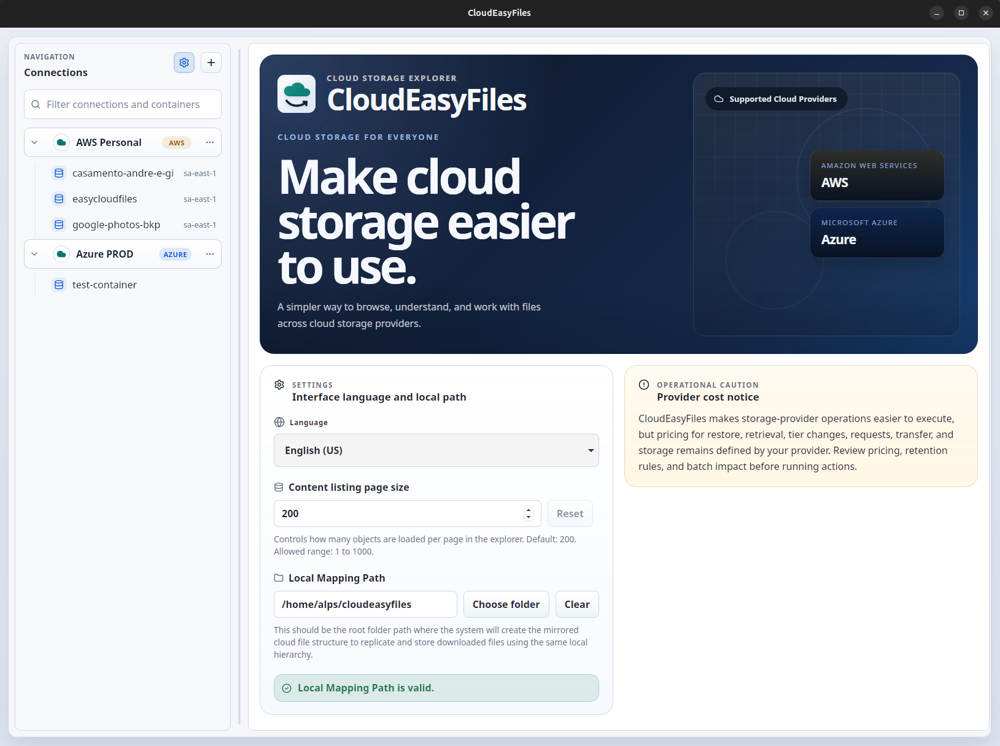
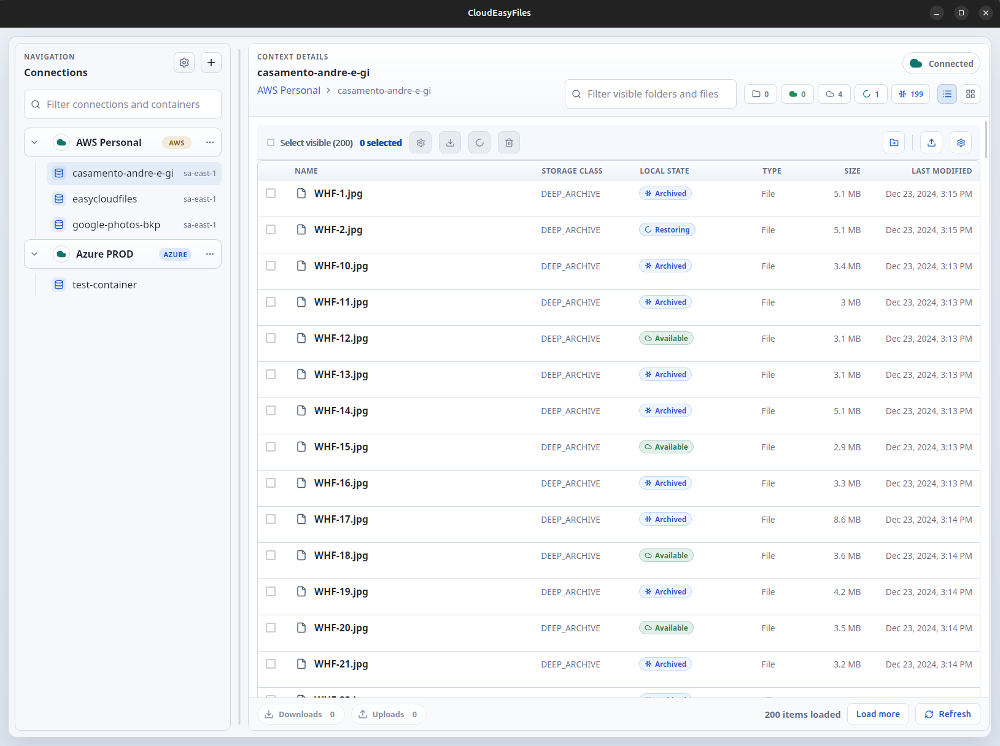
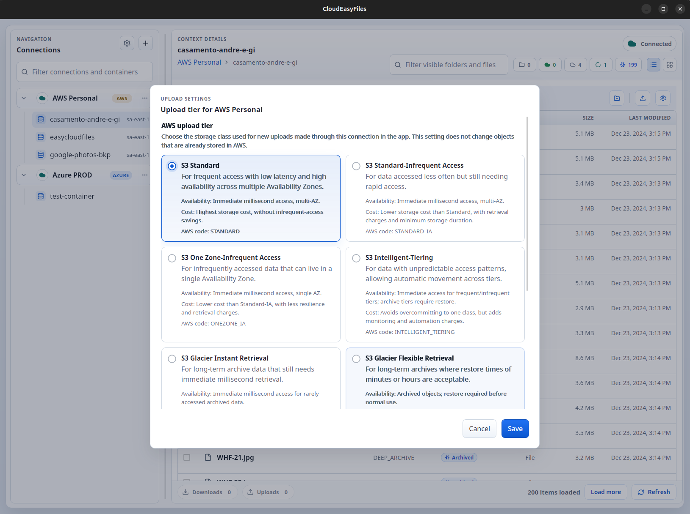
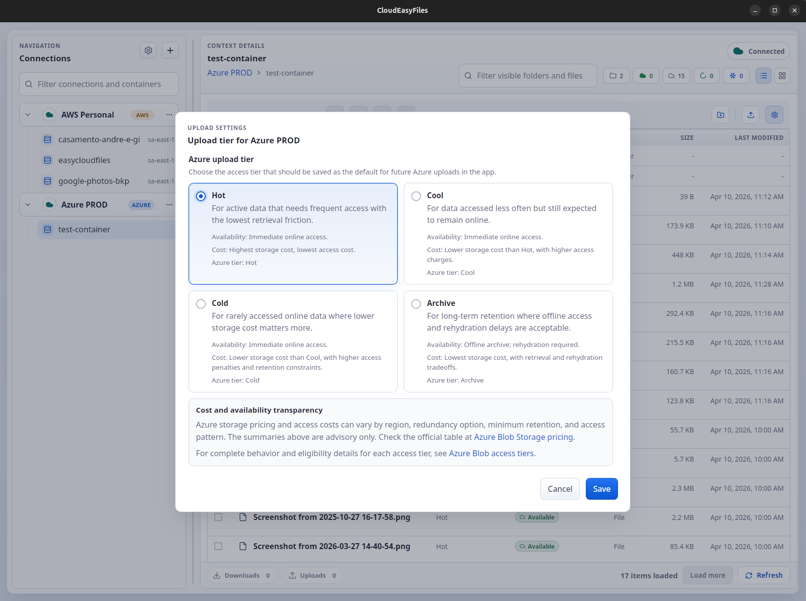

# CloudEasyFiles

> Desktop app for cloud backup, archive access, and file management.

CloudEasyFiles is a Tauri desktop application that makes cloud storage easier to use for backup, archive access, and everyday file management. The product supports AWS S3 and Azure Blob Storage today, with room to support other providers over time.



## Product Screens

<p align="center">
  
  
</p>

<p align="center">
  
</p>

## Current Status

The current public release line includes working AWS and Azure support, with release automation for packaged desktop installers.

Current implementation highlights:

- Saved AWS and Azure connections with secure credential storage
- Bucket and container browsing with incremental loading
- Folder-style navigation over flat object storage
- Upload, tracked download, and `Download As`
- Folder creation and delete workflows
- Tier changes for AWS and Azure
- AWS restore requests for archived objects
- Azure Archive rehydration with destination tier and priority
- Local cache awareness, transfer tracking, and cancelation

## Support Matrix

| Capability | AWS S3 | Azure Blob Storage |
| --- | --- | --- |
| Connection create/edit/test/delete | Yes | Yes |
| Browse buckets/containers and objects | Yes | Yes |
| Incremental listing and filters | Yes | Yes |
| Upload | Yes | Yes |
| Tracked download and `Download As` | Yes | Yes |
| Folder creation | Yes | Yes |
| Delete files and folders | Yes | Yes |
| Tier change | Yes | Yes |
| Archived content recovery | Restore | Rehydration |

## Why This Project Exists

Everyone needs backups, but the common options are not ideal. External drives are expensive, easy to lose, and easy to damage. Cloud providers offer low-cost and reliable storage, especially in archive tiers, but their consoles are often difficult for normal users to understand.

CloudEasyFiles exists to make these services easier to use.

The product direction is simple:

- make cloud backup and archive services easier to understand
- keep restore and rehydration flows clear
- support real provider features without making the UI harder than it needs to be
- stay practical enough for real use and clear enough for public review

## Tech Stack

- Desktop shell: Tauri
- Backend: Rust
- Frontend: React, TypeScript, Vite
- Styling: CSS
- AWS integration: AWS SDK for Rust
- Azure integration: Azure Blob Storage data-plane integration in Rust

## Local Development

### Prerequisites

- Node.js
- Rust
- Tauri platform prerequisites for your OS

### Commands

```bash
npm install
npm run tauri:dev
```

Quality checks:

```bash
npm run check
```

Available scripts:

- `npm run dev`
- `npm run build`
- `npm run check`
- `npm run check:frontend`
- `npm run check:rust`
- `npm run tauri:dev`
- `npm run tauri:build`

## Packaging and Releases

Local Linux bundles can be generated with:

```bash
npm run tauri:build
```

The repository also includes GitHub Actions workflows for:

- continuous integration on pushes and pull requests
- manual Linux release builds that publish `.deb`, `.rpm`, and `AppImage` artifacts
- tag-based GitHub Releases that publish Linux and Windows installers as release assets

Latest published installers:

- [GitHub Releases](https://github.com/andre-luiz-pires-silva/cloudeasyfiles/releases/latest)

## Documentation Map

- Project index: [PROJECT.md](./PROJECT.md)
- Architecture docs: [`docs/architecture`](./docs/architecture)
- Product docs: [`docs/product`](./docs/product)
- ADRs: [`docs/decisions`](./docs/decisions)
- Feature specs and plans: [`features`](./features)
- Release notes: [`docs/releases`](./docs/releases)

## Repository Quality

The repository baseline is intentionally lightweight but explicit:

- frontend build must pass
- `cargo check` must pass
- pull requests use a review checklist
- manual release artifacts are generated by workflow
- key product and architecture decisions are documented in-repo

## Roadmap Direction

Near-term professionalization work after the current feature set:

- tighten repository docs and screenshots
- expand CI and release hygiene
- add more automated verification where it adds real signal
- continue reducing rough edges in packaging and platform integration

## Contributing and Security

- Contribution guide: [CONTRIBUTING.md](./CONTRIBUTING.md)
- Security policy: [SECURITY.md](./SECURITY.md)

## License

[MIT](./LICENSE)
